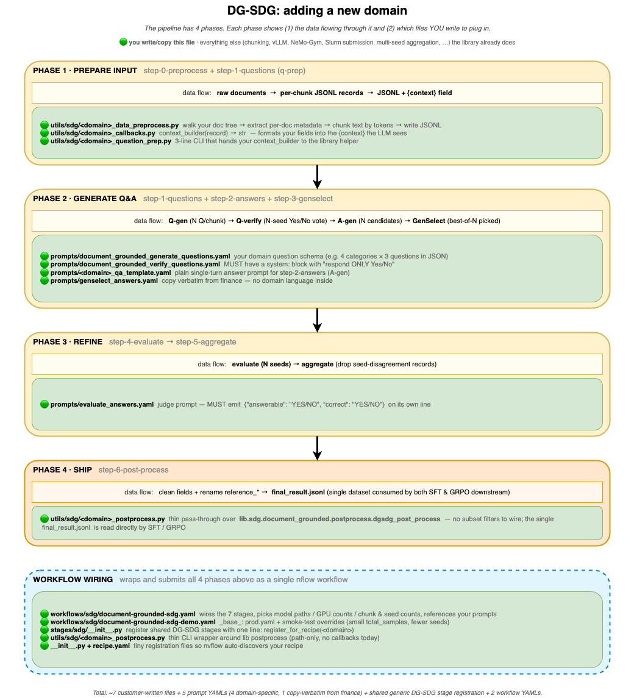

# Adding a New Domain to DG-SDG

> Turn a directory of your own documents into a fine-tuning dataset
> (single `final_result.jsonl` consumed by both SFT and GRPO) by adding a
> new "recipe" to nvflow's Document-Grounded SDG pipeline.
>
> **Audience**: anyone — a coworker or an AI agent — who can read this doc
> (plus the code it links to), gather the domain-specific info, and build a
> new recipe end-to-end. It should be self-contained enough that handing it
> over is all it takes. The pipeline runs on a Slurm cluster.
>
> **Worked example**: a `legal` recipe with court opinions at
> `/data/legal/cases/<court>/<year>/<case>.html`.  Substitute your own
> domain name wherever you see `legal` / `<your_domain>`.

The section numbers below mirror the phases in the diagram:



## What you write, in 1 picture

```
nvflow/recipes/<your_domain>/
├── prompts/
│   ├── document_grounded_generate_questions.yaml   §2
│   ├── document_grounded_verify_questions.yaml     §2
│   ├── <your_domain>_qa_template.yaml              §2 (reused in §3)
│   ├── evaluate_answers.yaml                       §3
│   └── genselect_answers.yaml                      §2 (cp from finance verbatim)
├── utils/sdg/
│   ├── <your_domain>_data_preprocess.py            §1
│   ├── <your_domain>_callbacks.py                  §1 + §4
│   └── <your_domain>_question_prep.py              §1
│   └── <your_domain>_postprocess.py                §5 (thin wrapper)
├── stages/sdg/                                     §5 (register shared generic DG-SDG stages)
│   └── __init__.py                                 §5
├── workflows/sdg/
│   ├── document-grounded-sdg.yaml                  §5
│   └── document-grounded-sdg-demo.yaml             §5
├── __init__.py                                     §5
├── stages/__init__.py                              §5
├── stages/sdg/__init__.py                          §5
├── utils/__init__.py                               §5
├── utils/sdg/__init__.py                           §5
└── recipe.yaml                                     §5
```

---

## §0  Prerequisites + directory skeleton

Before you start, verify:

- nvflow repo checked out on the launcher/host; run commands from the repo root (`ls nvflow/recipes/finance` works). At runtime this code ships to workers via the nemo-run packaged snapshot (`/nemo_run/code`) — it is not mounted.
- Cluster config exists (`ls cluster_configs/my_cluster.yaml`)
- `nemo-gym` container available (`enroot list | grep nemo-gym`) — the gym-only client the shared DG-SDG generation stages run in (Gym source at `/opt/Gym`, per-component venvs baked at `/opt/gym-venvs`; no `nemo-rl` image or runtime `uv sync` needed for SDG)
- Model weights mounted (`ls /hf_models/openai/gpt-oss-120b` and `ls /hf_models/Qwen/Qwen3-235B-A22B-Instruct-2507`)
- `nflow --help` works
- Your raw documents are in one root directory
- A short snake_case domain name picked (this guide uses `legal`)

Then create the skeleton:

```bash
cd <your-nvflow-checkout>   # repo root
export DOMAIN=legal     # CHANGE ME

mkdir -p nvflow/recipes/$DOMAIN/{prompts,utils/sdg,stages/sdg,workflows/sdg}
touch nvflow/recipes/$DOMAIN/__init__.py \
      nvflow/recipes/$DOMAIN/stages/__init__.py \
      nvflow/recipes/$DOMAIN/stages/sdg/__init__.py \
      nvflow/recipes/$DOMAIN/utils/__init__.py \
      nvflow/recipes/$DOMAIN/utils/sdg/__init__.py
```

---

## §1  Phase 1 · PREPARE INPUT

Three Python files under `utils/sdg/`.  They cover the diagram's Phase 1:
turn raw documents into JSONL records, then attach a `context` string to
each record so the LLM has something to read.

### 1.1  `<your_domain>_data_preprocess.py`

Walks your raw document tree and writes one JSONL file with one record per
chunk.  **You** run this once manually (and the workflow re-runs it as
step 0).  The fields you emit here become the input contract for
`context_builder` in 1.2.

```python
#!/usr/bin/env python3
"""Preprocess <your_domain> documents into per-chunk JSONL records."""

from __future__ import annotations

import argparse
import json
import re
from pathlib import Path
from typing import Any, Iterable

from bs4 import BeautifulSoup

try:
    import tiktoken
    _ENC = tiktoken.get_encoding("cl100k_base")
except ImportError:
    _ENC = None


def _tokenize(text: str) -> list[str]:
    return _ENC.encode(text) if _ENC is not None else text.split()


def _detokenize(tokens) -> str:
    return _ENC.decode(tokens) if _ENC is not None else " ".join(tokens)


def chunk_text(text: str, max_tokens: int = 2000, overlap_tokens: int = 100) -> Iterable[str]:
    toks = _tokenize(text)
    step = max(max_tokens - overlap_tokens, 1)
    for i in range(0, len(toks), step):
        chunk = toks[i : i + max_tokens]
        if chunk:
            yield _detokenize(chunk)
        if i + max_tokens >= len(toks):
            break


def extract_metadata(html_path: Path) -> dict[str, Any]:
    # CUSTOMIZE for your file layout.  The keys returned here must be a
    # superset of what context_builder reads in 1.2.
    parts = html_path.parts
    try:
        court, year = parts[-3], parts[-2]
    except IndexError:
        court, year = "", ""
    return {
        "case_name": re.sub(r"[_\-]+", " ", html_path.stem).strip(),
        "court": court,
        "decision_year": year,
        "section": "Opinion",
        "doc_path": str(html_path),
    }


def extract_body_text(html_path: Path) -> str:
    soup = BeautifulSoup(html_path.read_text(encoding="utf-8", errors="ignore"), "html.parser")
    for tag in soup(["script", "style", "nav", "footer", "header"]):
        tag.decompose()
    return soup.get_text(separator="\n", strip=True)


def main(input_dir: Path, output_dir: Path, max_tokens: int, overlap_tokens: int) -> int:
    output_dir.mkdir(parents=True, exist_ok=True)
    out_path = output_dir / f"{input_dir.name}-data.jsonl"
    n_records = 0
    with open(out_path, "w", encoding="utf-8") as out:
        for html_path in sorted(input_dir.rglob("*.html")):
            meta = extract_metadata(html_path)
            body = extract_body_text(html_path)
            if not body.strip():
                continue
            for chunk_idx, chunk_str in enumerate(chunk_text(body, max_tokens, overlap_tokens)):
                rec = {**meta, "chunk_id": chunk_idx, "content": chunk_str}
                out.write(json.dumps(rec, ensure_ascii=False) + "\n")
                n_records += 1
    print(f"Wrote {n_records} records to {out_path}")
    return n_records


if __name__ == "__main__":
    p = argparse.ArgumentParser()
    p.add_argument("--input_dir", type=Path, required=True)
    p.add_argument("--output_dir", type=Path, required=True)
    p.add_argument("--max_tokens", type=int, default=2000)
    p.add_argument("--overlap_tokens", type=int, default=100)
    # The Stage 0 shim (generic_stage/sdg/document_grounded/dg_sdg_preprocess.py) ALWAYS
    # passes these four extra flags too. You must accept them even if your
    # domain doesn't sample by a distribution -- otherwise argparse aborts
    # the Slurm job with "unrecognized arguments". Ignore the ones you don't
    # use (finance reads multiple CSVs from --distribution_dir; see note below).
    p.add_argument("--distribution_dir", type=Path, default=None)
    p.add_argument("--total_samples", type=int, default=150000)
    p.add_argument("--max_skip_count", type=int, default=20000)
    p.add_argument("--seed", type=int, default=42)
    args = p.parse_args()
    main(args.input_dir, args.output_dir, args.max_tokens, args.overlap_tokens)
```

> **Stage 0 CLI contract — accept all 8 flags.** The generic shim invokes
> your module as
> `python3 -m <domain>_data_preprocess --input_dir … --output_dir …
> --distribution_dir … --max_tokens … --overlap_tokens … --total_samples …
> --max_skip_count … --seed …`. Your argparse must define every one of these
> (the four above plus the four sampling flags) or the job crashes before it
> does any work. `distribution_dir` is currently **required by the shim's
> `validate_config`**, so the workflow YAML must set
> `stages.dg_sdg_preprocess.distribution_dir` even if your CLI ignores it
> (point it at a dir with a placeholder CSV).
>
> **Multi-CSV input is supported.** `--distribution_dir` is a *directory*, not
> a single file, so a domain can read any number of CSVs from it. Finance
> reads four (`{10k,10q}_{1company,2company}_distribution.csv`); there is no
> generic constraint on count or naming — your CLI decides what to load.
>
> For non-HTML inputs replace `extract_body_text` with whatever extracts
> text from your format (`.read_text()`, `pypdf`, `pdfminer.six`, etc.).
> Chunking + metadata logic stays the same.
>
> **Finance counterpart** (for reference): `nvflow/recipes/finance/utils/sdg/dg_sdg_data_preprocess.py`.
> Keep the `_data_` infix to avoid confusion with the stage name
> `dg_sdg_preprocess`.

### 1.2  `<your_domain>_callbacks.py` (context_builder)

A pure function: `(record) → str`.  Called by the library once per record
during step-1 question generation.  Empty string ⇒ skip the record.

The fields you reference here MUST match what 1.1 writes.

```python
"""Domain-specific callbacks for the <your_domain> DG-SDG recipe."""

from typing import Any


def legal_context_builder(record: dict[str, Any]) -> str:
    case_name = record.get("case_name", "")
    court = record.get("court", "")
    year = record.get("decision_year", "")
    section = record.get("section", "Opinion")
    content = record.get("content", "")

    if not content:
        return ""

    return (
        f"**{year} {court}: {case_name}**\n\n"
        f"**Section: {section}**\n\n"
        f"{content}\n"
    )

# §4 will add is_legal_sft_eligible / is_legal_rl_eligible to this same file.
```

> **Finance counterpart**: `nvflow/recipes/finance/utils/sdg/sec_callbacks.py`
> (finance uses `sec_*` prefix not `finance_*`; the file is named after the
> SECQUE benchmark for historical reasons).

### 1.3  `<your_domain>_question_prep.py`

A 20-line CLI that bolts `context_builder` into the lib's generic helper.
This is the only place `context_builder` is actually invoked, and it's
what the workflow's step-1 entrypoint calls.

```python
"""Thin CLI: construct_question_generate_input with the legal context_builder."""

import argparse
from pathlib import Path

from nvflow.lib.sdg.document_grounded.preprocess import construct_question_generate_input
from nvflow.recipes.legal.utils.sdg.legal_callbacks import legal_context_builder


if __name__ == "__main__":
    p = argparse.ArgumentParser()
    p.add_argument("--input_folder", type=Path, required=True)
    p.add_argument("--output_file", type=Path, required=True)
    args = p.parse_args()

    construct_question_generate_input(
        args.input_folder,
        args.output_file,
        context_builder=legal_context_builder,
    )
```

> **Finance counterpart**: `nvflow/recipes/finance/utils/sdg/sec_question_prep.py`.

---

## §2  Phase 2 · GENERATE Q&A

Four prompt YAMLs under `prompts/`.  Two are domain-specific (you write
them), two come straight from finance (copy verbatim).

> **JSON braces in YAML prompts**: literal `{` / `}` must be doubled
> (`{{` / `}}`) because Python `.format()` substitutes `{context}` etc.

### 2.1  `document_grounded_generate_questions.yaml` (Q-gen)

Generates ~12 questions per chunk in valid JSON the lib can parse.

```yaml
# nvflow/recipes/legal/prompts/document_grounded_generate_questions.yaml
user: |-
  You are a senior legal analyst.  You will be given an excerpt from a court
  opinion or other legal document.

  Your task is to propose the most important questions a legal researcher
  should ask about the excerpt.  Generate exactly 3 questions for EACH of
  the following categories:
    - Holding_and_Reasoning
    - Procedural_History
    - Legal_Standard_Applied
    - Implications_and_Precedent

  Respond ONLY with a valid JSON object.  No markdown, no commentary.

  Output Format:
  {{
    "Holding_and_Reasoning":      ["q1", "q2", "q3"],
    "Procedural_History":         ["q1", "q2", "q3"],
    "Legal_Standard_Applied":     ["q1", "q2", "q3"],
    "Implications_and_Precedent": ["q1", "q2", "q3"]
  }}

  Document: {context}
```

> If you change the schema (different categories / counts), you also need a
> custom `generation_parser` for the next stage — easier to keep this shape.

### 2.2  `document_grounded_verify_questions.yaml` (Q-verify)

Per-question Yes/No verdict.  **The `system:` block is mandatory** —
without "respond ONLY Yes/No" the verifier regex silently drops ~30%+ of
valid questions.

```yaml
# nvflow/recipes/legal/prompts/document_grounded_verify_questions.yaml
system: |-
  You are a legal expert validating analytical questions.  Decide if a given
  question is valid, expert-level, and answerable using only the Reference
  Text.

  Criteria for "Yes":
  1. The Reference Text contains the facts needed to answer.
  2. The question is non-trivial and assesses legal reasoning.

  Criteria for "No":
  1. The Reference Text lacks the specific data or context.
  2. The question is malformed or unrelated.

  Respond ONLY with "Yes" or "No".

user: |-
  **Reference Text:**
  {context}

  **Question:**
  {problem}

  Is this a valid expert-level question answerable from the text?
```

### 2.3  `<your_domain>_qa_template.yaml` (A-gen prompt)

The single-turn answer prompt used by the answer-generation stage
(`generate_answers`, step-2).

```yaml
# nvflow/recipes/legal/prompts/legal_qa_template.yaml
user: |-
  You are a legal expert.  Given a court-opinion excerpt and a question
  written by a senior analyst, answer using ONLY the provided text.  Do not
  use external knowledge.  Be concise but precise.  If the text does not
  support an answer, say so explicitly.

  Document: {context}

  Question: {problem}

  Answer:
```

> **Finance counterpart**: `nvflow/recipes/finance/prompts/secque_template.yaml`
> (the prod workflow YAML references it once, as the `generate_answers` stage's
> `++prompt_config`).

### 2.4  `genselect_answers.yaml` (best-of-N picker)

Generic, copy verbatim from finance:

```bash
cp nvflow/recipes/finance/prompts/genselect_answers.yaml \
   nvflow/recipes/$DOMAIN/prompts/genselect_answers.yaml
```

---

## §3  Phase 3 · REFINE

One prompt YAML you write: the judge for the `evaluate_answers` stage.
(`aggregate_answers` then folds the per-seed verdicts into a consensus
`answerable` and needs no prompt.)

### 3.1  `evaluate_answers.yaml` (judge for seed-evaluation stage)

Must emit a one-line JSON tag `{"answerable": "YES/NO", "correct": "YES/NO"}`
on the **last** line — `evaluate.parse_evaluation` regex looks for exactly
that shape.

```yaml
# nvflow/recipes/legal/prompts/evaluate_answers.yaml
user: |-
  You are evaluating an AI assistant's answer to a legal question grounded
  in the provided court-opinion excerpt.

  You need to decide TWO things:
  1. ANSWERABLE: can the question be answered using only the excerpt?
  2. CORRECT:    is the assistant's response appropriate?

  ANSWERABLE assessment:
    - YES: excerpt contains the necessary facts / citations / reasoning.
    - NO:  excerpt lacks the necessary information.

  CORRECT assessment:
    - When ANSWERABLE=YES: assistant gives an accurate, well-supported answer.
    - When ANSWERABLE=NO:  assistant correctly identifies info is missing.

  Provide your reasoning first, then end with this exact JSON tag on a new line:
  {{"answerable": "YES/NO", "correct": "YES/NO"}}

  Document: {context}

  Question: {problem}

  Assistant's Answer: {generation}
```

---

## §4  Phase 4 · SHIP

No subset-eligibility callbacks are needed. The pipeline emits a single
`final_result.jsonl` per run; downstream SFT / GRPO workflows pick
records by reading that file directly. If you later need a curated SFT
or GRPO subset, do it as a separate post-process step outside DG-SDG
(e.g. a small CLI in your recipe's `utils/`).

The only domain-specific callback used by the shared stages is the
context-builder (`<your_domain>_context_builder`) wired into
`generate_verified_questions` via the `question_prep_script`, which you
already added in §1.2.

---

## §5  Workflow wiring + launch

Last lap: register shared DG-SDG stages, add one postprocess wrapper,
drop in 5 registration files, write the 2 workflow YAMLs, then launch.

### 5.1  Register shared DG-SDG stages + add postprocess wrapper

Add a thin domain wrapper around `nvflow.lib.sdg.document_grounded.postprocess`.
There is nothing domain-specific to inject by default — it exists only
so the workflow YAML can point at a recipe-owned path, leaving room for
domain-specific cleaning later:

```python
# nvflow/recipes/legal/utils/sdg/legal_postprocess.py
import argparse
import os
import sys

from nvflow.lib.sdg.document_grounded.postprocess import dgsdg_post_process

if __name__ == "__main__":
    parser = argparse.ArgumentParser(
        description="Post-process DG-SDG data for the legal recipe."
    )
    parser.add_argument("--input_file", required=True)
    parser.add_argument("--output_dir", required=True)
    parser.add_argument("--seed", type=int, default=42)
    args = parser.parse_args()

    if not os.path.exists(args.input_file):
        sys.exit(f"Input file not found: {args.input_file}")

    dgsdg_post_process(args.input_file, args.output_dir, seed=args.seed)
```

### 5.2  `__init__.py` × 3 + `recipe.yaml`

```python
# nvflow/recipes/legal/__init__.py
from . import stages  # noqa: F401
```

```python
# nvflow/recipes/legal/stages/__init__.py
from . import sdg  # noqa: F401
```

```python
# nvflow/recipes/legal/stages/sdg/__init__.py
from nvflow.generic_stage.sdg.document_grounded import register_for_recipe

register_for_recipe("legal")
```

```yaml
# nvflow/recipes/legal/recipe.yaml
recipe: legal
description: "End-to-end pipeline for legal-domain model training and evaluation"

workflow_order:
  - document_grounded_sdg
```

### 5.3  Production workflow YAML

Start from finance and edit paths:

```bash
cp nvflow/recipes/finance/workflows/sdg/document-grounded-sdg.yaml \
   nvflow/recipes/$DOMAIN/workflows/sdg/document-grounded-sdg.yaml
```

Then edit (search for the strings on the left):

| Find                                                          | Replace with                                                                          |
| ------------------------------------------------------------- | ------------------------------------------------------------------------------------- |
| `recipe: finance`                                             | `recipe: legal`                                                                       |
| `description: "generate synthetic finance data ..."`          | `description: "generate synthetic legal data ..."`                                    |
| `base_data_dir: /workspace/outputs/finance/...`               | `base_data_dir: /workspace/outputs/legal/workflow-document-grounded-sdg`              |
| `filings_dir: /workspace/outputs/finance/...`                 | `filings_dir: /data/legal/cases` (your raw doc root)                                  |
| `pipeline_stages: [- dg_sdg_preprocess, ...]`                 | Keep as-is. Order is `dg_sdg_preprocess → generate_verified_questions → generate_answers → gym_genselect_answers → evaluate_answers → aggregate_answers → dgsdg_post_process` (7 shared stages) |
| `stages: dg_sdg_preprocess:` block name                       | Keep block name; set `preprocess_module` to your `<domain>_data_preprocess` module path |
| `stages: generate_verified_questions:` block                  | Set `question_prep_script: nvflow/recipes/<domain>/utils/sdg/<domain>_question_prep.py` |
| `stages: generate_answers:` block                             | Nothing domain-specific; inherits `gym_*` from prod. Tune `answer_preprocess_kwargs.threshold` if needed |
| `stages: gym_genselect_answers:` block                        | Set `prompt_template: nvflow/recipes/<domain>/prompts/genselect_answers.yaml` |
| `stages: dgsdg_post_process:` block                           | Add `postprocess_script: nvflow/recipes/<domain>/utils/sdg/<domain>_postprocess.py` |
| `++prompt_config=…/prompts/document_grounded_*.yaml` (Q-gen + Q-verify) | Repoint both to `nvflow/recipes/legal/prompts/…`                            |
| `++prompt_config=…/prompts/secque_template.yaml` (A-gen)      | `…/prompts/legal_qa_template.yaml`                                                    |
| `prompt_template: …/prompts/evaluate_answers.yaml` (evaluate stage) | `nvflow/recipes/legal/prompts/evaluate_answers.yaml`                            |
| `finance_domain_keep_fields:` anchor + 6 stage refs           | Rename anchor to `<domain>_domain_keep_fields:`, replace member fields with **every** domain key your callbacks / preprocess CLI write to JSONL that you want to survive to final training data. (Stages 1–6 carry the anchor; Stage 0 `dg_sdg_preprocess` does not trim.) See §5.6 for the full mechanics. |

> **Don't touch** `gym_path`, `gym_container`,
> `gym_config_paths_format_verification`, `gym_agent_format_verification`,
> `verifier_passthrough`, `verifier_parse_vote` — they reference the gym-only
> container, upstream Gym envs, and SDG overlay YAMLs, all of which are
> domain-agnostic.
>
> **Don't touch** model paths under `args: model: /hf_models/…` unless you
> want different models.  Finance defaults (gpt-oss-120b for Q-gen + A-gen,
> Qwen3-235B for Q-verify + judges) are strong general-purpose choices.

### 5.4  Demo workflow YAML

Inherit prod via `_base_:` and override just the "make it small + fast"
knobs:

```yaml
# nvflow/recipes/legal/workflows/sdg/document-grounded-sdg-demo.yaml
recipe: legal
workflow:
  name: "document_grounded_sdg"
  type: "sdg"
  description: "demo (smoke test) of document-grounded SDG for legal"

cluster: my_cluster
_base_: document-grounded-sdg.yaml

base_data_dir: /workspace/outputs/legal/demo/workflow-document-grounded-sdg-demo
filings_dir: /data/legal/cases     # or a small subdir for smoke

stages:
  dg_sdg_preprocess:
    max_tokens: 2000
    overlap_tokens: 200
    total_samples: 200            # prod uses 150_000

  generate_verified_questions:
    question_verify_kwargs:
      args:
        num_random_seeds: 3
        num_chunks: 4

  generate_answers:
    answer_preprocess_kwargs:
      threshold: 0.5
    answer_generation_kwargs:
      args:
        num_random_seeds: 3

  gym_genselect_answers:
    num_chunks: 1
    num_random_seeds: 1

  evaluate_answers:
    num_chunks: 1
    num_random_seeds: 1
```

> Domain paths (`preprocess_module`, `question_prep_script`, `postprocess_script`,
> `prompt_template`) are inherited from prod via `_base_:` deep-merge — no need
> to repeat them in demo.

### 5.5  Launch

```bash
uv run nflow run-all \
    --config nvflow/recipes/$DOMAIN/workflows/sdg/document-grounded-sdg-demo.yaml
```

That submits all 7 stages with `afterok` Slurm dependencies and returns
immediately.

Output lands in `base_data_dir`:

```
$base_data_dir/
├── step-0-preprocess/jsonl/*.jsonl
├── step-1-questions/
│   ├── generated/       # raw Q-gen rollouts
│   └── verified/        # Q-verify rollouts (consumed by step-2)
├── step-2-answers/
│   └── generated/output-rs*.jsonl   # N candidate answers per question
├── step-3-genselect/selected_answers.jsonl
├── step-4-evaluate/output-rs*.jsonl
├── step-5-aggregate/aggregated_answers.jsonl
└── step-6-post-process/
    └── final_result.jsonl    # single cleaned + renamed dataset for SFT / GRPO
```

To launch production (after demo works): swap to
`document-grounded-sdg.yaml` (no `-demo` suffix).

### 5.6  Stage boundary trim (`domain_keep_fields`)

Every generic DG-SDG stage (Stages 1 through 6) projects its output JSONL
to an allowlist before the next stage reads it. The trim runs inside the
same Slurm job that produces the output, so there is **no extra dependency
to wire and no extra wall-time cost**.

The allowlist is the set union:

```
STAGE_KEEP[stage]      # generic fields the lib code produces / needs
| domain_keep_fields   # extra fields your recipe writes that you want to survive
- ALWAYS_DROP          # NeMo-Gym noise that we always strip
```

`STAGE_KEEP[stage]` and `ALWAYS_DROP` live in
[`nvflow/generic_stage/sdg/document_grounded/_schemas.py`](../../../../nvflow/generic_stage/sdg/document_grounded/_schemas.py) —
you should not need to edit either when adding a new domain.

**What you write**: one YAML anchor in your prod workflow YAML and a
reference from each of the 6 trim-eligible stage blocks (Stage 0
`dg_sdg_preprocess` does not trim because it manufactures the initial
JSONL from raw documents):

```yaml
# ---- top of document-grounded-sdg.yaml ----
legal_domain_keep_fields: &legal_domain_keep_fields
  - case_id            # every field your callbacks / preprocess CLI
  - jurisdiction       # write into JSONL that you want to survive
  - filing_year        # all the way to step-6-post-process
  # ... (omit raw text fields like `content*` — see gotcha below)

stages:
  generate_verified_questions:
    # ... existing keys ...
    domain_keep_fields: *legal_domain_keep_fields
  generate_answers:
    domain_keep_fields: *legal_domain_keep_fields
  gym_genselect_answers:
    domain_keep_fields: *legal_domain_keep_fields
  evaluate_answers:
    domain_keep_fields: *legal_domain_keep_fields
  aggregate_answers:
    domain_keep_fields: *legal_domain_keep_fields
  dgsdg_post_process:
    domain_keep_fields: *legal_domain_keep_fields
```

The demo YAML inherits everything via `_base_:` deep-merge — no override
needed.

**Generic `STAGE_KEEP` cheat-sheet** (for context — you don't need to
list these in `domain_keep_fields`):

| Stage                         | Keep |
| ----------------------------- | ---- |
| `generate_verified_questions` | `context`, `problem`, `question_type`, `generation` |
| `generate_answers`            | + `question_voting_pass_rate`, `question_voting_total`, `reasoning_content`, and the Responses-API original form of each candidate answer (`answer_response`, `answer_responses_create_params`) |
| `gym_genselect_answers`       | + `reference_answer`, `reference_reasoning`, the picked answer's Responses-API original form (`reference_response`, `reference_responses_create_params`), `genselect_answers_metadata` (drops multi-candidate scaffolding) |
| `evaluate_answers`            | as above + `evaluate_generation` |
| `aggregate_answers`           | as above + `answerable` (drops `evaluate_generation`) |
| `dgsdg_post_process`          | renames `reference_*` → `answer` / `reasoning_content` / `response` / `responses_create_params`, adds `expected_answer` (mirrors `answer`), drops `generation` + `genselect_answers_metadata`; keeps voting stats |

**Common gotchas:**

- **Silent drop**: if your `context_builder` or postprocess wrapper writes
  a field that's not in `domain_keep_fields`, it is **silently removed at
  the first stage boundary**. The final training data won't have it. Add
  the field to the anchor.
- **`content0/1/2` / raw text**: finance intentionally omits these. The
  Q-prep callback folds them into `context`, so the raw markdown is
  redundant after Stage 0. If your domain produces raw text that you want
  to ship to SFT, either fold it into `context` in your callback or list
  it in `domain_keep_fields`.
- **Per-record schema variance**: if your domain emits records with
  different field shapes (finance has 1-company vs 2-company variants),
  list the **union** of all variants in the anchor. The trim allowlist
  treats missing fields as a no-op (no error).
- **Stage 0 has no trim**: it writes whatever your `<domain>_data_preprocess`
  CLI writes. If you write junk fields, Stage 1's trim catches them, but
  it's cleaner to write only the fields you intend to propagate.
